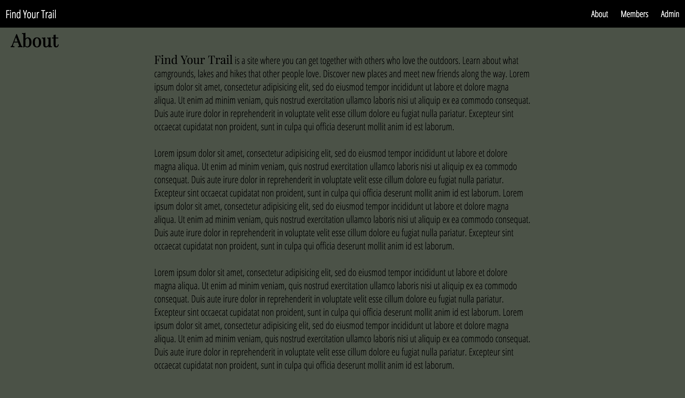
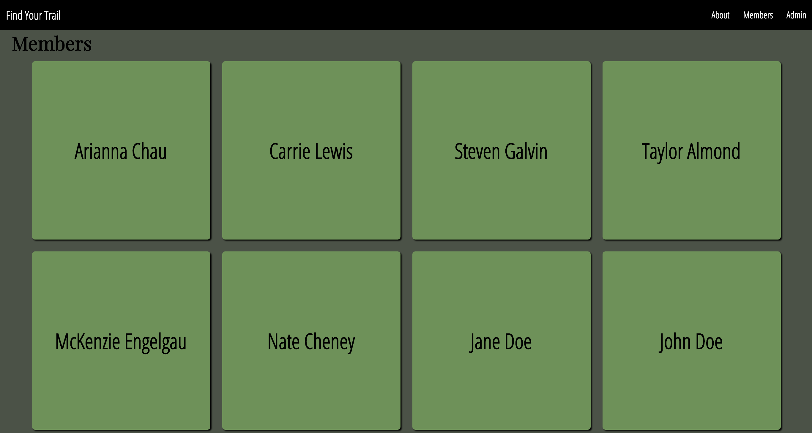

# Club Tracker
### Arianna Chau, July 14th, 2017
[](https://github.com/ariannachau/week3)

This web app was made primarily with Angular 4 and the Angular CLI, Typescript, and the Firebase Database. It's purpose is to show off my week 3 knowledge from Epicodus and my efficiency with the above. This club tracker is a simple app designed to give the user the ability to see a list of club members as well as view their specific details on a dynamic page. There is also an admin side that allows the admins to create, update, and delete members.

## Landing Page:


## About Page:


## Members Page:


## Planning

### 1. Configuration/dependencies
  The app will primarily use Angular 4, the AngularCLI, Firebase database, and Typescript. It was made with what I learned from week 3 in the JavaScript track at Epicodus. Stretch goals include:
    * Host the site live

### 2. User Stories
  * As a user, I'd like to visit a page to see a list of all team or club members.
  * As a user, I'd like to click a team or club member's entry in the list to visit their profile page, which should include more details about them.
  * As a user, I'd like the option to visit an "About" page that explains what the club is, and what they do.
  * As a user, I'd like all data persisted in a database, so it's always there when I need it.
  * As a user, I'd like to filter the list of users by their particular role in the group, or some other information/category. (For instance, a club may have a treasurer, president, and/or secretary. A sports team may have a goalie, forward, or striker, a book club may have founders and attendees. You're also welcome to filter by something other than role, if it's more relevant to your project.)
  * As an administrator, I want to add new users to the club. (User authentication is not required).
  * As an administrator, I want to edit user profiles, in case I make a mistake, or need to update their details.
  * As an administrator, need the option to delete a user, in case they leave the club or team.

### 3. Integration
  * Root component/Index page.
  * Contact page
  * About page
  * List members page.
  * Admin page with CRUD functionality for members

### 4. UX/UI
  * Sass

### 5. Polish
  * Refactor code.
  * Delete unused code.

## Prerequisites

You will need the following things properly installed on your computer.

* [Git](https://git-scm.com/)
* [Node.js](https://nodejs.org/) (with NPM)
* [Typescript](https://www.typescriptlang.org/)
* [Angular 4](https://angularjs.org/)

## Installation

As of writing this README, these instructions work on MacOS.

* Run `$ git clone <this-repository-url>`
* Then `$ cd week3`
* Once in the week3 folder, run `$ npm install`
* You will need to remake the api-keys.ts file. Login to firebase and create your own project here https://firebase.google.com/
  * Once logged in, click on 'Go To Console'.
  * Then click 'Add project', give it a name, and select your region.
  * Next, click 'Add Firebase to your web app'.
  * Grab this block of code:
```
var config = {
    apiKey: "xxxx",
    authDomain: "xxxx.firebaseapp.com",
    databaseURL: "https://xxxx.firebaseio.com",
    projectId: "xxxx",
    storageBucket: "",
    messagingSenderId: "xxxx"
  };
```
  * Create an `api-keys.ts` file inside the app directory and copy the block of code into it.
  * Replace `var config` with `export var masterFirebaseConfig`
  * To finish setting firebase up, go to firebase and and go into the database tab.
    * Click on the button made of three dots.
    * Select the Import JSON option.
    * Select browse, navigate to the project folder, and open the `sample-member.json` file.
    * Select Import and your database should be complete!

## Running / Development

Now that everything you need should be installed and setup, we can run it with angular.

* Run `$ ng serve`
* Visit your app at [http://localhost:4200](http://localhost:4200).

## Built With

* Angular4
* AngularCLI
* Firebase
* Typescript
* HTML
* CSS/SASS
* ES6
* Node

## Authors

Arianna Chau

## License

MIT License

Copyright (c) Arianna Chau, 2017

Permission is hereby granted, free of charge, to any person obtaining a copy
of this software and associated documentation files (the "Software"), to deal
in the Software without restriction, including without limitation the rights
to use, copy, modify, merge, publish, distribute, sublicense, and/or sell
copies of the Software, and to permit persons to whom the Software is furnished to do so, subject to the following conditions:

The above copyright notice and this permission notice shall be included in all
copies or substantial portions of the Software.
